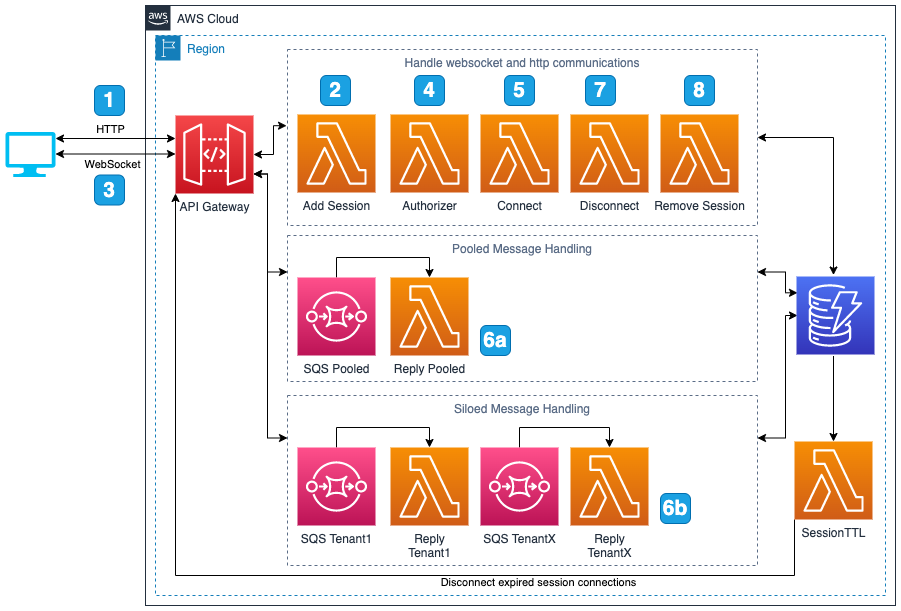

# API Gateway Websocket SaaS Rate Limiting using AWS Lambda Authorizer

When creating a SaaS multi-tenant systems which require websocket connections we need a way to rate limit those connections on a per tenant basis. 
With Amazon API Gateway you have the option to use usage plans with HTTP connections however they are not available for websockets. 
To enable rate limiting we can use a <a href="https://docs.aws.amazon.com/apigateway/latest/developerguide/apigateway-use-lambda-authorizer.html">API Gateway Lambda Authorizer</a> to validate a connection and control access. 
Using a Lambda Authorizer we can implement code to allow the system to valid connection rates and throttle inbound connections on a per tenant basis.
This sample also demonstrates pool and silo modes for handling the message traffic per tenant.
The pool mode simply uses a single AWS Lambda to process all inbound messages using the authorization context to handle tenant isolation.
The silo mode uses Amazon SQS to enable per tenant FIFO queue message ordering. 
An Amazon SQS queue and AWS Lambda function is create for each tenant to allow for per tenant throttling and FIFO queue isolation per session of a tenant.

## Architecture


1. The client send an HTTP PUT request to the Amazon API Gateway HTTP endpoint to create a session for a tenant. This call could also be authenticated if required but that is outside the scope of this sample.
2. The session AWS Lambda will create a session and store it in the DynamoDB with a TTL (Time To Live) value specified which will remove all session connections if no communication is sent or received over a specific period of time.
3. Once a session is created the client will initiate a websocket connection to the Amazon AWS API Gateway websocket endpoint.
4. An AWS Lambda function is used as the Authorizer for the websocket connection. The authorizer will do the following:
   <ol type="a" style="list-style-type: lower-alpha;">
      <li>Validate the tenant exists</li>
      <li>Validate the session exists</li>
      <li>Add the tenantId, sessionId, and tenant settings to the authorizer context</li>
   </ol>
5. An AWS Lambda function is used during connect to do the following:
   <ol type="a" style="list-style-type: lower-alpha;">
      <li>Check if the system is over the total number of <b>connections</b> allowed for this <b>tenant</b></li>
      <li>Check if the system is over the total number of <b>connections</b> allowed for this <b>session</b></li>
      <li>Check if the system is over the total number of <b>connections per minute</b> allowed for the <b>tenant</b></li>
      <li>Check if the system is over the total number of <b>connections per minute</b> allowed for the <b>session</b></li>
      <li>Add the connectionId to the sessions connectionId set and update the session Time To Live (TTL)</li>
      <li>Increment the total number of connections for the tenant</li>
   </ol>
6. Messages are processed as either silo or pooled depending on the route selected 
   <ol type="a" style="list-style-type: lower-alpha;">
     <li>To process message per tenant in silo mode with FIFO, messages are sent to the tenants corresponding SQS FIFO queue with the tenant, session, tenant settings, and connection ids as metadata.</li>
     <li>An AWS Lambda function per tenant is used to read messages from the SQS FIFO queue with session based grouping to keep messages in order. The Lambda will also send the inbound message AND the response to all other connectionIds for the same session. Each inbound message will also update the session TTL.</li>
     <li>An AWS Lambda function is invoked for each message received by a websocket connection. The Lambda will respond by echoing the message back to the sender. The Lambda will also send the inbound message AND the response to all other connectionIds for the same session. Each inbound message will also update the session TTL.</li>
   </ol>
7. An AWS Lambda function is used during disconnect to do the following:
   <ol type="a" style="list-style-type: lower-alpha;">
     <li>Remove the connectionId from the sessions connectionId set</li>
     <li>Decrement the total number of connections for the tenant</li>
   </ol>
8. Once all connections are closed the client will send an HTTP DELETE request to the Amazon API Gateway HTTP endpoint to remove the session.
9. An AWS Lambda function is used to process all DynamoDB stream updates. This function will check for TTL events and remove connections for sessions that expire.

## Requirements
1. <a href="https://maven.apache.org/">Apache Maven</a> 3.8.1
2. <a href="https://aws.amazon.com/cdk/">AWS CDK</a> 1.125.0 or later installed

## Setup
1. git clone this repository
2. In the root directory of the repository execute the command ```cdk deploy```
3. Review the permissions and follow prompts
4. After deployment the CDK will list the outputs as follows:
   1. APIGatewayWebsocketRateLimitStack.SampleClient
      1. The URI points to the sample web page described below
   2. APIGatewayWebsocketRateLimitStack.SessionURL
      1. This URI points to the endpoint which is able to create sessions
   3. APIGatewayWebsocketRateLimitStack.TenantURL
      1. This URI is only exposed for demo purposes and is used to get a list of the current tenant Ids
   4. APIGatewayWebsocketRateLimitStack.WebSocketURL
      1. This URI is the websocket connection endpoint

## Sample Web Page


The sample can be used to test the various aspects of the system. The following steps are the happy path:
1. Open the web page given as the output **APIGatewayWebsocketRateLimitStack.SampleClient** from the CDK deployment
2. Wait for the tenant Ids to load
3. Click the **Create Session** button to create a new session
4. Click the **Connect** button
5. Once connected try both the **Send** and **Send Queue** buttons
   1. The **Send** button will send via the **default** route which uses the pooled execution model
   2. The **Send Queue** button will send via the **PerTenantSQS** route which uses the siloed SQS FIFO queue execution model
6. Click the **Disconnect** button to close the connection
7. Click the **Delete Session** button to remove the current session

## Cleanup
1. In the root directory of the repository execute the command ```cdk destroy```

## Silo vs Pooled Message processing
### Silo
SQS queues and siloed Lambdas per tenant are used in silo mode. The API gateway will use the authorization contexts tenantId to determine the queue name per tenant. Each SQS queue has a linked Lambda function to process messages which send an echo reply.
### Pooled
Basic API Gateway to Lambda execution is used for pooled mode. Each message received by the API gateway on the default route will invoke the reply Lambda. The Lambda will use the authorization context to handle tenant isolation.

## DynamoDB Table Structures
All tables access is restricted by a partition key condition to only allow access to rows for which the primary index matches the current tenantId.

#### Tenant Table
The tenant table is used to store the tenantIds and option details to allow each tenant to specify different rate limits.

Fields
1. tenantId (String) (Partition Key) - The tenantId
2. connectionsPerSession (Number) - The max number of connections each session is allowed
3. tenantConnections (Number) - The max number of connections this tenant is allowed
4. sessionPerMinute (Number) - The max number of connections per minute for a session
5. tenantPerMinute (Number) - The max number of connections per minute for this tenant
6. sessionTTL (Number) - The session time to live value in seconds. This is used each time activity happens for a session to increase the time period before a session times out and connections are dropped. The TTL value is set as current time plus this value.
7. messagesPerMinute (Number) - The total number of messages per minute this tenant is allowed to process before throttling the tenant.

#### Limit Table
The limit table is used to store the current limit counts for each tenant and also the per minute counts.

Fields
1. key (String) (Partition Key) - This key field can be one of three formats
    1. tenantId - If the key is a single tenantId then it is tracking the total number of connections for this tenant
    2. tenantId:minute:{epoch} - If the key is the tenantId:minute:{epoch} then it is tracking the current number of connections per minute for the tenant within the {epoch} value start time + 60 seconds.
    3. tenantId:sessionId:minute:{epoch} - If the key is the tenantId:sessionId:minute:{epoch} then it is tracking the current number of connections per minute for the session within the {epoch} value start time + 60 seconds.
2. itemCount (Number) - The current value for the limit
3. itemTTL (Number) (TTL) - The time to live value for DynamoDB to remove this item. This is used for the per minute connection rates to remove expired rows.

#### Session Table
The session table keeps track of sessions per tenant and will expire sessions after a set amount of time

Fields
1. tenantId (String) (Partition Key) - The tenantId
2. sessionId (String) (Sort Key) - The sessionId
3. connectionIds (Set [String]) - The current connectionIds for this session. This is used to keep track of the number of connections per session. It is also used to send reply messages to all connections on a specific session.
4. sessionTTL (Number) (TTL) - the time to live value for DynamoDB to remove this item. This value is used to removed expired sessions and disconnect any lingering connections associated.

## Security

See [CONTRIBUTING](CONTRIBUTING.md#security-issue-notifications) for more information.

## License

This library is licensed under the MIT-0 License. See the LICENSE file.